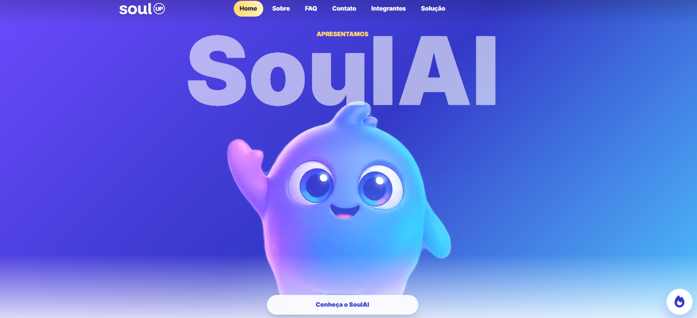
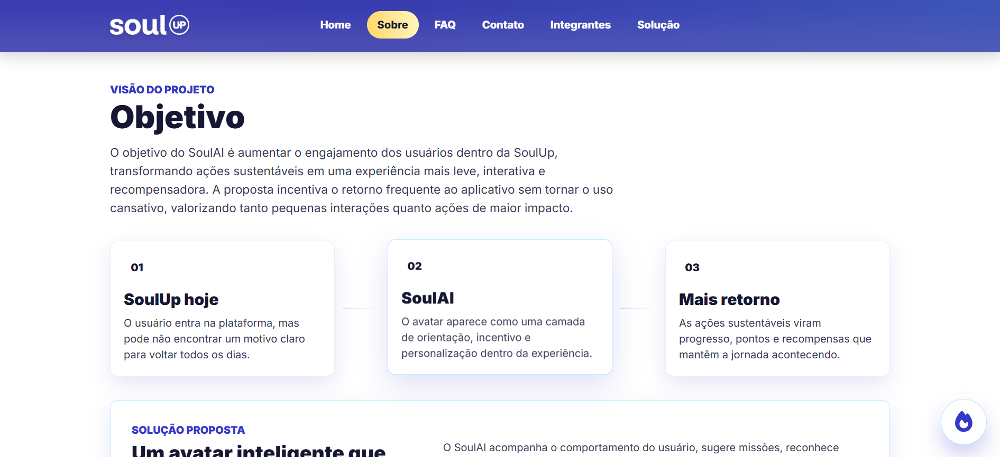
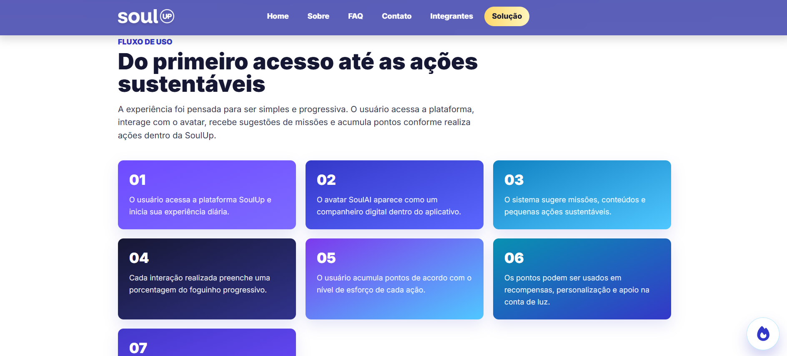
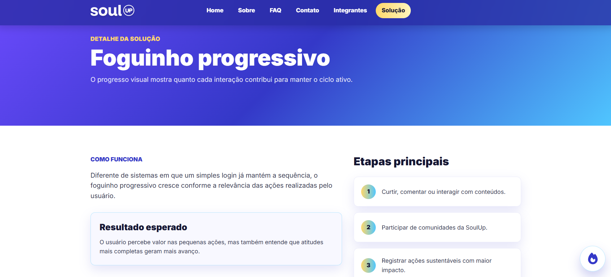
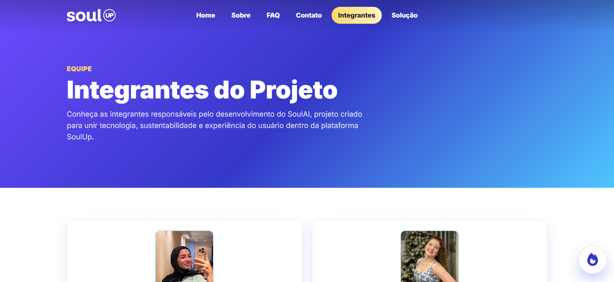

# SoulAI - SoulUp

<p align="center">
  
</p>

<p align="center">
  
</p>

<h3 align="center">
  Avatar inteligente, gamificação e sustentabilidade dentro da experiência SoulUp.
</h3>

<p align="center">
  Projeto acadêmico desenvolvido para o <strong>Challenge FIAP 2026</strong>.
</p>

<p align="center">
  
  
  
  
</p>

<p align="center">
  
  
  
</p>

<p align="center">
  <a href="https://manuelalramos.github.io/SoulAi_Projeto/">
    
  </a>
  <a href="https://github.com/manuelalramos/SoulAi_Projeto">
    
  </a>
</p>

---

## Sumário

- [Sobre o projeto](#sobre-o-projeto)
- [Problema identificado](#problema-identificado)
- [Proposta do SoulAI](#proposta-do-soulai)
- [Objetivos](#objetivos)
- [Evolução do projeto](#evolução-do-projeto)
- [Por que migramos para React](#por-que-migramos-para-react)
- [Tecnologias utilizadas](#tecnologias-utilizadas)
- [Arquitetura atual](#arquitetura-atual)
- [Fluxo de inicialização](#fluxo-de-inicialização)
- [Estrutura de pastas](#estrutura-de-pastas)
- [Responsabilidade das pastas](#responsabilidade-das-pastas)
- [Sistema de rotas](#sistema-de-rotas)
- [Páginas da aplicação](#páginas-da-aplicação)
- [Componentes reutilizáveis](#componentes-reutilizáveis)
- [Dados e tipos](#dados-e-tipos)
- [Hooks](#hooks)
- [Layout global](#layout-global)
- [Formulário de contato](#formulário-de-contato)
- [Gerenciamento de estado](#gerenciamento-de-estado)
- [Responsividade](#responsividade)
- [Acessibilidade](#acessibilidade)
- [Identidade visual](#identidade-visual)
- [Prints do projeto](#prints-do-projeto)
- [Tailwind CSS](#tailwind-css)
- [Qualidade e validações](#qualidade-e-validações)
- [Git Flow e histórico](#git-flow-e-histórico)
- [Padrão de commits](#padrão-de-commits)
- [Limpeza do código Vanilla](#limpeza-do-código-vanilla)
- [Como instalar](#como-instalar)
- [Como executar](#como-executar)
- [Scripts disponíveis](#scripts-disponíveis)
- [Como testar](#como-testar)
- [Deploy](#deploy)
- [Limitações atuais](#limitações-atuais)
- [Possíveis evoluções futuras](#possíveis-evoluções-futuras)
- [Integrantes](#integrantes)
- [Links](#links)
- [Contato](#contato)
- [Resumo das decisões técnicas](#resumo-das-decisões-técnicas)
- [Conclusão](#conclusão)

---

## Sobre o projeto

O **SoulAI** é uma proposta de evolução da experiência digital da plataforma **SoulUp**.

A solução foi criada a partir da ideia de transformar o uso da plataforma em uma experiência mais interativa, personalizada e recorrente por meio de um **avatar inteligente**.

O avatar funciona como um companheiro digital dentro da experiência SoulUp. Ele ajuda o usuário a compreender suas possibilidades dentro da plataforma, acompanhar seu progresso, receber sugestões de ações e visualizar recompensas relacionadas ao seu engajamento.

O projeto combina:

- inteligência artificial como conceito de personalização;
- gamificação;
- missões;
- progresso visual;
- recompensas;
- interação com avatar;
- sustentabilidade;
- experiência do usuário;
- incentivo ao retorno frequente à plataforma.

O site desenvolvido apresenta essa proposta de forma visual, navegável, responsiva e organizada.

---

## Problema identificado

Aplicações relacionadas a sustentabilidade podem ter dificuldade em manter o usuário interessado por longos períodos.

Mesmo quando uma plataforma oferece benefícios importantes, o usuário pode:

- entrar poucas vezes;
- não saber qual ação realizar em seguida;
- não visualizar claramente seu progresso;
- não perceber recompensas imediatas;
- perder o interesse ao longo do tempo;
- não criar uma rotina de uso.

O SoulAI foi pensado para atuar nesse ponto.

A proposta não substitui a SoulUp. Ela funciona como uma **camada adicional de interação, personalização e gamificação** dentro da experiência já existente.

---

## Proposta do SoulAI

O SoulAI propõe um avatar inteligente capaz de acompanhar a jornada do usuário e transformar ações dentro da plataforma em uma experiência mais clara e recompensadora.

Entre os principais conceitos apresentados estão:

### Avatar inteligente

O avatar atua como um companheiro digital que orienta, incentiva e reconhece o progresso do usuário.

### Missões

O usuário pode receber pequenas sugestões de ações sustentáveis ou atividades relacionadas à plataforma.

### Foguinho progressivo

O progresso não depende apenas de entrar no aplicativo. Cada ação contribui de maneira diferente para o preenchimento do foguinho.

Ações simples possuem peso menor, enquanto ações mais relevantes podem gerar progresso maior.

### Pontos

As interações realizadas pelo usuário podem gerar pontos proporcionais ao nível de esforço e importância da ação.

### Recompensas

Os pontos acumulados podem ser associados a:

- personalização do avatar;
- itens especiais;
- benefícios;
- recompensas;
- apoio relacionado à conta de luz.

### Engajamento

A combinação desses recursos cria novos motivos para o usuário retornar à SoulUp e continuar participando.

---

## Objetivos

O projeto possui como objetivo principal:

> Aumentar o engajamento dos usuários dentro da SoulUp, transformando ações sustentáveis em uma experiência mais interativa, personalizada e recompensadora.

Também fazem parte dos objetivos:

- estimular o retorno frequente à plataforma;
- tornar o progresso mais visível;
- facilitar a compreensão das funcionalidades;
- criar uma experiência mais próxima do público jovem;
- utilizar gamificação sem tornar o uso cansativo;
- conectar tecnologia e sustentabilidade;
- melhorar a experiência do usuário;
- apresentar a proposta em uma aplicação web moderna e responsiva.

---

## Evolução do projeto

Um dos pontos importantes desta Sprint foi a migração da aplicação, que anteriormente utilizava **HTML, CSS e JavaScript Vanilla**, para uma arquitetura baseada em **React, TypeScript, Vite e Tailwind CSS**.

A versão anterior possuía uma estrutura parecida com:

```text
SoulAi_Projeto/
├── index.html
├── pages/
│   ├── sobre.html
│   ├── funcionalidades.html
│   ├── integrantes.html
│   ├── faq.html
│   └── contato.html
├── assets/
│   ├── css/
│   ├── js/
│   └── media/
└── README.md
```

Cada página possuía seu próprio HTML, os estilos estavam distribuídos em arquivos CSS e os comportamentos eram controlados por JavaScript.

Durante a Sprint, essa estrutura foi usada como referência de conteúdo e identidade visual, mas a implementação foi reconstruída gradualmente em React.

A migração aconteceu por etapas:

1. criação do projeto com Vite;
2. configuração do React;
3. adição do TypeScript;
4. configuração do Tailwind CSS;
5. criação da estrutura de pastas;
6. componentização de partes repetidas;
7. configuração do sistema de rotas;
8. migração das páginas;
9. criação de dados e tipos separados;
10. implementação de interações;
11. ajustes de responsividade;
12. melhorias de acessibilidade;
13. remoção dos arquivos legados não utilizados.

O histórico de commits do repositório mostra essa evolução por branches e Pull Requests.

---

## Por que migramos para React

A migração trouxe uma organização mais adequada para uma aplicação com várias páginas e comportamentos interativos.

No código Vanilla, elementos como Header, Footer, menu, cards e seções precisavam ser repetidos ou tratados manualmente. Com React, essas partes puderam ser transformadas em componentes reutilizáveis.

Exemplos de componentes reutilizáveis criados:

- Header;
- Footer;
- NavMenu;
- PageIntro;
- Carrossel;
- TeamCard;
- FAQItem;
- FloatingChat.

A arquitetura também passou a separar melhor:

- interface;
- dados;
- tipos;
- rotas;
- comportamentos;
- páginas;
- componentes.

Isso facilita:

- manutenção;
- leitura;
- reutilização;
- evolução;
- identificação de responsabilidades;
- trabalho em equipe;
- validação técnica antes da entrega.

---

## Tecnologias utilizadas

### React

Responsável pela construção da interface por componentes.

Foi utilizado para criar:

- páginas;
- componentes reutilizáveis;
- estados;
- interações;
- formulários;
- carrossel;
- FAQ;
- chat;
- navegação.

### TypeScript

O TypeScript foi utilizado para adicionar tipagem ao projeto.

Em vez de trabalhar com objetos sem estrutura definida, o projeto possui tipos para diferentes domínios.

Exemplos:

- `TeamMember`;
- `SolutionFeature`;
- `ContactFormData`;
- `FaqQuestion`;
- `CardContent`;
- `NavigationItem`;
- `ChatMessage`.

Isso ajuda a evitar erros e deixa explícito quais dados cada componente espera receber.

### Vite

O Vite é utilizado como ferramenta de desenvolvimento e build.

Ele é responsável por:

- iniciar o servidor local;
- processar os módulos;
- integrar React;
- criar o build final;
- gerar a pasta `dist`.

### Tailwind CSS

O Tailwind CSS é responsável pela maior parte da estilização da interface.

A decisão da Sprint foi evitar recriar vários arquivos CSS externos por página. Por isso, os estilos específicos dos componentes são aplicados principalmente por classes utilitárias.

Exemplo:

```tsx
className="rounded-xl border border-soul-blue/10 bg-white p-6 shadow-card"
```

### React Router DOM

Responsável pela navegação da SPA.

É utilizado para:

- páginas estáticas;
- rota dinâmica;
- navegação sem recarregar toda a aplicação;
- parâmetros de URL;
- navegação programática;
- página 404.

### React Hook Form

Utilizado no formulário de contato.

Responsável por:

- registro dos campos;
- submissão;
- validações;
- mensagens de erro;
- reset do formulário.

### Oxlint

Utilizado para análise estática do código através do comando:

```bash
npm run lint
```

### PostCSS e Autoprefixer

Fazem parte da configuração do Tailwind CSS e do processamento do CSS.

### Font Awesome

Utilizado para ícones presentes na aplicação, como:

- menu;
- e-mail;
- localização;
- redes sociais;
- setas;
- botão flutuante do chat.

### Google Fonts

Utilizado para carregar a fonte **Inter**, usada como fonte principal da interface.

---

## Principais dependências

O projeto utiliza atualmente as seguintes dependências principais:

```json
{
  "react": "^19.2.8",
  "react-dom": "^19.2.8",
  "react-hook-form": "^7.87.0",
  "react-router-dom": "^7.18.3"
}
```

Entre as principais dependências de desenvolvimento estão:

- TypeScript;
- Vite;
- Tailwind CSS;
- PostCSS;
- Autoprefixer;
- Oxlint;
- `@vitejs/plugin-react`;
- `@types/react`;
- `@types/react-dom`;
- `@types/node`.

---

## Arquitetura atual

A arquitetura foi organizada por responsabilidade.

A aplicação segue este fluxo:

```text
index.html
  -> src/main.tsx
  -> RouterProvider
  -> App.tsx
  -> MainLayout
  -> Outlet
  -> Page
  -> Sections / Components
  -> Data + Types
```

Essa divisão evita concentrar toda a aplicação em um único arquivo e ajuda a separar o que é estrutura, página, componente, conteúdo e tipo.

---

## Fluxo de inicialização

### 1. `index.html`

É o documento HTML inicial carregado pelo navegador.

Ele possui:

```html
<div id="root"></div>
```

Essa `div` funciona como ponto de entrada da aplicação React.

Também são carregados nesse arquivo:

- metadados básicos;
- favicon;
- fonte Inter;
- Font Awesome;
- script principal do Vite.

### 2. `src/main.tsx`

O `main.tsx` inicializa a aplicação.

Nele são configurados:

- `StrictMode`;
- `createRoot`;
- `createBrowserRouter`;
- `RouterProvider`;
- importação do CSS global.

O router define as rotas principais da aplicação e renderiza cada página dentro do layout global.

### 3. `src/App.tsx`

O `App` representa a estrutura principal da aplicação.

Ele utiliza:

```tsx
<Outlet />
```

O `Outlet` representa o local onde o React Router renderiza a página correspondente à URL atual.

De forma simplificada:

```text
App
└── MainLayout
    ├── Header
    ├── main
    │   └── Outlet
    ├── FloatingChat
    └── Footer
```

### 4. `MainLayout`

O `MainLayout` evita repetição entre as páginas.

Ele centraliza:

- Header;
- elemento `main`;
- chat flutuante;
- Footer.

---

## Estrutura de pastas

A estrutura atual segue aproximadamente a organização abaixo:

```text
SoulAi_Projeto/
├── .github/
├── dist/
├── node_modules/
├── public/
│   └── icone.png
├── src/
│   ├── assets/
│   │   └── media/
│   │       ├── avatar_hero.mp4
│   │       ├── fogo.png
│   │       ├── icone.png
│   │       ├── logo-soulup.png
│   │       ├── foto_lena.jpeg
│   │       ├── foto_lyvia.jpeg
│   │       ├── foto_manuela.jpg
│   │       └── foto_yasmin.jpeg
│   ├── components/
│   │   ├── Carrossel/
│   │   ├── FAQItem/
│   │   ├── FloatingChat/
│   │   ├── Footer/
│   │   ├── Header/
│   │   ├── NavMenu/
│   │   ├── PageIntro/
│   │   └── TeamCard/
│   ├── data/
│   │   ├── about.ts
│   │   ├── chat.ts
│   │   ├── faq.ts
│   │   ├── home.ts
│   │   ├── navigation.ts
│   │   ├── solution.ts
│   │   └── team.ts
│   ├── hooks/
│   │   └── useScrollToTop.ts
│   ├── layouts/
│   │   └── MainLayout/
│   ├── pages/
│   │   ├── Contato/
│   │   ├── FAQ/
│   │   ├── Home/
│   │   ├── Integrantes/
│   │   ├── NotFound/
│   │   ├── Sobre/
│   │   └── Solucao/
│   ├── routes/
│   │   ├── Contato/
│   │   ├── FAQ/
│   │   ├── Home/
│   │   ├── Integrantes/
│   │   ├── NotFound/
│   │   ├── Sobre/
│   │   ├── Solucao/
│   │   └── SolucaoDetalhe/
│   ├── types/
│   │   ├── card.ts
│   │   ├── chat.ts
│   │   ├── faq.ts
│   │   ├── form.ts
│   │   ├── navigation.ts
│   │   ├── solution.ts
│   │   └── team.ts
│   ├── App.tsx
│   ├── index.css
│   └── main.tsx
├── .gitignore
├── .oxlintrc.json
├── index.html
├── package-lock.json
├── package.json
├── postcss.config.cjs
├── README.md
├── tailwind.config.cjs
├── tsconfig.app.json
├── tsconfig.json
├── tsconfig.node.json
└── vite.config.ts
```

Observação: `node_modules/` e `dist/` são pastas geradas localmente e não precisam ser versionadas no repositório.

---

## Responsabilidade das pastas

### `public`

Guarda arquivos estáticos servidos diretamente pelo Vite.

Atualmente contém o ícone usado como favicon:

```text
public/icone.png
```

### `src/assets/media`

Guarda imagens e vídeos usados pela interface.

Exemplos:

- logo da SoulUp;
- ícone do projeto;
- vídeo do avatar na hero;
- vídeo do mockup do chat;
- imagem do foguinho;
- fotos das integrantes.

### `src/components`

Guarda componentes reutilizáveis.

Esses componentes não representam páginas completas. Eles são blocos menores usados em várias partes da aplicação.

### `src/data`

Centraliza conteúdos estáticos da aplicação.

Exemplos:

- perguntas do FAQ;
- integrantes;
- itens de navegação;
- mensagens do chat;
- funcionalidades da solução;
- textos da página Sobre;
- cards da Home.

Separar os dados dos componentes facilita manutenção e evita que textos longos fiquem espalhados pela interface.

### `src/hooks`

Guarda hooks próprios.

Atualmente possui:

```text
useScrollToTop.ts
```

Esse hook leva o usuário ao topo da tela quando a rota muda.

### `src/layouts`

Guarda estruturas compartilhadas entre páginas.

Atualmente existe:

```text
MainLayout
```

### `src/pages`

Guarda a implementação visual de cada página.

Algumas páginas possuem uma pasta `sections` para separar blocos internos e deixar a leitura mais organizada.

### `src/routes`

Guarda arquivos de entrada para as rotas.

Essa camada separa o roteamento da implementação real das páginas.

### `src/types`

Guarda tipos TypeScript compartilhados.

Essa pasta define os formatos esperados para dados usados no projeto.

---

## Sistema de rotas

As rotas são configuradas em `src/main.tsx` com `createBrowserRouter`.

| Rota | Página renderizada | Observação |
|---|---|---|
| `/` | Home | Página inicial |
| `/sobre` | Sobre | Explica a proposta e os objetivos |
| `/integrantes` | Integrantes | Mostra a equipe |
| `/faq` | FAQ | Perguntas frequentes |
| `/contato` | Contato | Formulário validado |
| `/solucao` | Solução | Fluxo e funcionalidades |
| `/solucao/:slug` | Solução Detalhe | Rota dinâmica |
| `*` | NotFound | Página para rota inexistente |

### Rota dinâmica da solução

A rota:

```text
/solucao/:slug
```

permite abrir detalhes de uma funcionalidade sem criar uma página manual para cada item.

Os slugs vêm de `src/data/solution.ts`:

- `missoes`;
- `foguinho`;
- `pontos`;
- `avatar`.

Se o usuário acessar um slug inexistente, a aplicação mostra uma mensagem de recurso não encontrado e oferece botão de retorno para a página de solução.

---

## Páginas da aplicação

### Home

Arquivo principal:

```text
src/pages/Home/Home.tsx
```

Seções:

- `HeroSection`;
- `HomeAboutSection`;
- `HomeExperienceSection`.

A Home apresenta o SoulAI com um hero em vídeo, uma explicação inicial do projeto e um carrossel com pontos da experiência.

### Sobre

Arquivo principal:

```text
src/pages/Sobre/Sobre.tsx
```

Seções:

- `AboutObjectiveSection`;
- `AboutHighlightsSection`;
- `FireProgressSection`;
- `RoadmapSection`.

A página Sobre explica a relação entre SoulUp e SoulAI, apresenta objetivos, diferenciais e caminhos futuros.

### Solução

Arquivos principais:

```text
src/pages/Solucao/Solucao.tsx
src/pages/Solucao/SolucaoDetalhe.tsx
```

Seções:

- `FlowSection`;
- `FeatureShowcaseSection`;
- `SolutionDetailContent`.

A página mostra como o SoulAI funciona, quais etapas fazem parte da experiência e quais funcionalidades podem ser exploradas.

### FAQ

Arquivo principal:

```text
src/pages/FAQ/Faq.tsx
```

Usa o componente `FAQItem` para exibir perguntas e respostas de forma interativa.

### Integrantes

Arquivo principal:

```text
src/pages/Integrantes/Integrantes.tsx
```

Usa `TeamCard` para exibir:

- nome;
- RM;
- turma;
- foto;
- GitHub;
- LinkedIn.

### Contato

Arquivo principal:

```text
src/pages/Contato/Contato.tsx
```

Possui formulário com validações usando React Hook Form, modal de sucesso e redirecionamento automático para a Home.

### NotFound

Arquivo principal:

```text
src/pages/NotFound/NotFound.tsx
```

Renderiza uma página de erro quando o usuário acessa uma rota inexistente.

---

## Componentes reutilizáveis

### Header

Arquivo:

```text
src/components/Header/Header.tsx
```

Responsável pelo topo do site.

Funcionalidades:

- exibe a logo da SoulUp;
- abre e fecha o menu mobile;
- muda o visual após o scroll;
- fecha o menu ao trocar de rota;
- usa `useLocation` para reagir à navegação.

### NavMenu

Arquivo:

```text
src/components/NavMenu/NavMenu.tsx
```

Renderiza os links definidos em `src/data/navigation.ts`.

Usa `NavLink` para destacar a página ativa.

### Footer

Arquivo:

```text
src/components/Footer/Footer.tsx
```

Exibe informações do projeto, links de navegação e dados de contato.

### FloatingChat

Arquivo:

```text
src/components/FloatingChat/FloatingChat.tsx
```

Representa uma demonstração visual da interação com o SoulAI.

Funcionalidades:

- botão flutuante;
- abertura e fechamento do chat;
- mensagens aparecendo aos poucos;
- evento customizado para abrir o chat a partir da Home;
- indicador de digitação.

O chat é demonstrativo e usa dados locais de `src/data/chat.ts`.

### Carrossel

Arquivo:

```text
src/components/Carrossel/Carrossel.tsx
```

Componente reutilizável para apresentar cards em sequência.

Funcionalidades:

- botão anterior;
- botão próximo;
- indicadores;
- loop entre primeiro e último item;
- adaptação para mobile, tablet e desktop.

### PageIntro

Arquivo:

```text
src/components/PageIntro/PageIntro.tsx
```

Componente usado no topo de páginas internas para manter padrão visual.

### FAQItem

Arquivo:

```text
src/components/FAQItem/FAQItem.tsx
```

Renderiza uma pergunta do FAQ com controle de abertura e fechamento.

### TeamCard

Arquivo:

```text
src/components/TeamCard/TeamCard.tsx
```

Renderiza os dados de cada integrante.

---

## Dados e tipos

### Pasta `data`

A pasta `src/data` centraliza conteúdos estáticos.

| Arquivo | Responsabilidade |
|---|---|
| `about.ts` | conteúdo da página Sobre |
| `chat.ts` | mensagens da demonstração do chat |
| `faq.ts` | perguntas e respostas do FAQ |
| `home.ts` | cards da Home |
| `navigation.ts` | links do menu |
| `solution.ts` | funcionalidades, fluxo e detalhes da solução |
| `team.ts` | dados das integrantes |

### Pasta `types`

A pasta `src/types` centraliza tipos TypeScript.

| Arquivo | Tipo principal |
|---|---|
| `card.ts` | `CardContent` |
| `chat.ts` | `ChatMessage` |
| `faq.ts` | `FaqQuestion` |
| `form.ts` | `ContactFormData` |
| `navigation.ts` | `NavigationItem` |
| `solution.ts` | `SolutionFeature` |
| `team.ts` | `TeamMember` |

Essa separação ajuda a manter os componentes mais previsíveis e facilita a evolução dos dados.

---

## Hooks

### `useScrollToTop`

Arquivo:

```text
src/hooks/useScrollToTop.ts
```

Esse hook observa a mudança de rota com `useLocation` e executa:

```tsx
window.scrollTo(0, 0);
```

Assim, quando o usuário navega entre páginas, a nova rota começa no topo.

---

## Layout global

O layout global fica em:

```text
src/layouts/MainLayout/MainLayout.tsx
```

Ele organiza a estrutura compartilhada por todas as páginas:

```tsx
<>
  <Header />
  <main>{children}</main>
  <FloatingChat />
  <Footer />
</>
```

O `App.tsx` envolve o `Outlet` com esse layout, permitindo que todas as rotas compartilhem a mesma estrutura.

---

## Formulário de contato

O formulário de contato utiliza **React Hook Form**.

Campos:

- nome;
- e-mail;
- assunto;
- mensagem.

Validações:

- nome obrigatório;
- nome com pelo menos 3 caracteres;
- e-mail obrigatório;
- e-mail em formato válido;
- assunto obrigatório;
- mensagem obrigatória;
- mensagem com pelo menos 10 caracteres.

Quando o formulário é enviado corretamente:

1. a mensagem de sucesso é montada usando o primeiro nome do usuário;
2. o modal de sucesso é aberto;
3. o formulário é limpo;
4. uma contagem regressiva começa;
5. ao final da contagem, o usuário é redirecionado para a Home.

O formulário não envia dados para um backend. A validação e o fluxo de sucesso acontecem no front-end.

---

## Gerenciamento de estado

O projeto utiliza estados locais com hooks do React.

Exemplos:

- `useState` para abrir e fechar o menu mobile;
- `useState` para controlar o índice atual do carrossel;
- `useState` para abrir e fechar o chat flutuante;
- `useState` para controlar a quantidade de mensagens visíveis no chat;
- `useState` para controlar o modal de sucesso do contato;
- `useState` para controlar a contagem regressiva do formulário;
- `useEffect` para reagir ao scroll;
- `useEffect` para fechar menu ao mudar de rota;
- `useEffect` para exibir mensagens do chat aos poucos;
- `useRef` para controlar o elemento `<dialog>`.

Como a aplicação é institucional e demonstrativa, não foi necessário usar Context API, Redux ou banco de dados.

---

## Responsividade

O projeto foi estruturado para funcionar em diferentes tamanhos de tela.

Foram considerados:

- desktop;
- notebook;
- tablet;
- celular.

Recursos usados:

- classes responsivas do Tailwind;
- grids que mudam de coluna conforme o viewport;
- menu mobile;
- botões com largura adaptável;
- carrossel reorganizado para telas menores;
- cards com espaçamento flexível;
- `max-width` para limitar o conteúdo em telas grandes;
- prevenção de scroll horizontal.

Checklist recomendado:

```text
375px
425px
768px
992px
1440px
```

Conferir nessas larguras:

- Header;
- menu mobile;
- hero;
- vídeo;
- botões;
- cards;
- carrossel;
- FAQ;
- formulário;
- integrantes;
- solução;
- footer.

---

## Acessibilidade

O projeto utiliza recursos de acessibilidade em diferentes pontos da interface.

Exemplos:

- `aria-label` em botões de menu, chat, setas e links;
- `aria-expanded` no menu mobile e no chat;
- `aria-hidden` em ícones decorativos;
- `alt` em imagens relevantes;
- uso de `button` para ações de clique;
- uso de `label` associado aos campos do formulário;
- mensagens de erro próximas aos campos;
- HTML semântico com `header`, `main`, `section`, `article`, `aside`, `footer` e `nav`.

A acessibilidade foi tratada como parte da experiência de uso, especialmente na navegação, formulário, FAQ e chat.

---

## Identidade visual

O projeto segue uma identidade visual conectada com a SoulUp, usando uma base moderna, digital e limpa.

Cores principais configuradas no Tailwind:

| Token | Cor |
|---|---|
| `soul.purple` | `#6e4bff` |
| `soul.blue` | `#3438c8` |
| `soul.cyan` | `#50c7ff` |
| `soul.yellow` | `#ffd86b` |
| `soul.ink` | `#161733` |
| `soul.text` | `#33364f` |
| `soul.soft` | `#f5f6ff` |
| `soul.line` | `#e5e7f5` |

Foco visual:

- leitura clara;
- visual jovem;
- sensação tecnológica;
- contraste em botões e áreas importantes;
- uso de vídeos e imagens locais;
- consistência entre páginas;
- experiência adequada para diferentes telas.

---

## Prints do projeto

<p align="center">
  
</p>

<p align="center">
  
</p>

<p align="center">
  
</p>

<p align="center">
  
</p>

<p align="center">
  
</p>

<p align="center">
  
</p>

<p align="center">
  
</p>

<p align="center">
  
</p>

<p align="center">
  
</p>

Os prints foram colocados dentro da pasta `docs/prints/` para documentar a interface final sem confundir essas imagens com os arquivos usados pela aplicação.

---

## Tailwind CSS

O Tailwind está configurado em:

```text
tailwind.config.cjs
```

Esse arquivo centraliza:

- cores personalizadas;
- gradiente principal;
- sombras;
- animações;
- keyframes.

O CSS global fica em:

```text
src/index.css
```

Ele contém:

- diretivas do Tailwind;
- comportamento de scroll suave;
- base do `body`;
- fonte padrão;
- ajustes globais para imagens, vídeos, links, botões e campos.

---

## Qualidade e validações

O projeto possui scripts para validação técnica.

### Lint

```bash
npm run lint
```

Executa o Oxlint para análise estática.

Regras configuradas em `.oxlintrc.json`:

- `react/rules-of-hooks`;
- `react/only-export-components`.

### Build

```bash
npm run build
```

Executa:

```text
tsc -b
vite build
```

Esse comando verifica TypeScript e gera a versão de produção na pasta `dist`.

### Preview

```bash
npm run preview
```

Permite visualizar localmente a versão gerada pelo build.

---

## Git Flow e histórico

O desenvolvimento foi organizado com branches de feature e Pull Requests.

O uso do **Git Flow** foi escolhido para deixar o processo de desenvolvimento mais organizado e fácil de acompanhar. Como o projeto passou por várias etapas, cada parte importante foi separada em uma branch própria, permitindo trabalhar em funcionalidades específicas sem misturar alterações diferentes no mesmo momento.

Esse fluxo ajudou a documentar a evolução do projeto desde a configuração inicial em React até a criação das páginas, componentes, rotas, formulário, responsividade, acessibilidade e limpeza dos arquivos antigos.

As branches utilizadas foram mantidas no histórico do GitHub para registrar o caminho de desenvolvimento da equipe. Dessa forma, o professor consegue avaliar não apenas o resultado final, mas também como o projeto foi construído, revisado e integrado por etapas.

Branch atual observada no repositório:

```text
feature/final-docs
```

Exemplos de branches presentes no histórico:

- `feature/react-setup`;
- `feature/project-structure`;
- `feature/shared-layout`;
- `feature/router`;
- `feature/home-page`;
- `feature/about-page`;
- `feature/team-page`;
- `feature/faq-page`;
- `feature/solution-page`;
- `feature/dynamic-route`;
- `feature/contact-form`;
- `feature/not-found`;
- `feature/remove-legacy`;
- `feature/responsive-a11y`.

Essa organização mostra a evolução gradual do projeto, separando configuração, páginas, componentes, rotas, formulário, responsividade e limpeza dos arquivos antigos.

---

## Padrão de commits

O histórico utiliza mensagens curtas indicando o tipo da mudança.

Exemplos observados:

```text
feat : cria pagina not found
feat : adiciona validacoes ao formulario de contato
feat : adiciona as rotas dinamicas na pagina de solucao
refactor : remove arquivos legados não utilizados
style : add animacoes no hover
fix : corrige classe da fonte
chore : configura path base vite
```

Tipos comuns:

- `feat`: nova funcionalidade;
- `fix`: correção;
- `refactor`: reorganização sem mudar a proposta;
- `style`: ajustes visuais;
- `chore`: configuração ou manutenção.

---

## Limpeza do código Vanilla

Depois da migração para React, os arquivos antigos da versão Vanilla deixaram de ser necessários na versão final.

A aplicação atual não depende mais de:

```text
pages/*.html
assets/css/*
assets/js/script.js
src/App.css
```

A lógica e a interface foram migradas para:

- React;
- TypeScript;
- Tailwind CSS;
- React Router.

O histórico do Git preserva as versões anteriores, incluindo a tag:

```text
sprint02-vanilla-final
```

Assim, o código antigo pode ser consultado no histórico sem permanecer misturado à estrutura final.

---

## Como instalar

### Pré-requisitos

É necessário possuir:

- Node.js;
- npm;
- Git.

### 1. Clonar o repositório

```bash
git clone https://github.com/manuelalramos/SoulAi_Projeto.git
```

### 2. Entrar na pasta

```bash
cd SoulAi_Projeto
```

### 3. Instalar dependências

```bash
npm install
```

O comando usa `package.json` e `package-lock.json` para instalar as dependências necessárias.

---

## Como executar

Para iniciar o servidor de desenvolvimento:

```bash
npm run dev
```

O Vite mostrará um endereço semelhante a:

```text
http://localhost:5173/
```

Abra esse endereço no navegador.

---

## Scripts disponíveis

Os scripts estão configurados no `package.json`.

| Script | Comando | Descrição |
|---|---|---|
| `dev` | `npm run dev` | inicia o servidor Vite |
| `build` | `npm run build` | executa TypeScript e gera build de produção |
| `preview` | `npm run preview` | visualiza localmente o build |
| `lint` | `npm run lint` | executa análise estática com Oxlint |

---

## Como testar

### Navegação

Testar:

```text
/
/sobre
/integrantes
/faq
/contato
/solucao
```

### Rota dinâmica

Testar:

```text
/solucao/missoes
/solucao/foguinho
/solucao/pontos
/solucao/avatar
```

### Slug inexistente

Testar:

```text
/solucao/recurso-inexistente
```

Resultado esperado: página de recurso não encontrado com botão para voltar para a solução.

### Página 404

Testar:

```text
/essa-rota-nao-existe
```

Resultado esperado: página NotFound dentro do layout principal.

### Header

Validar:

- comportamento no topo;
- comportamento após scroll;
- menu mobile;
- fechamento ao navegar;
- item ativo no menu.

### Carrossel

Validar:

- botão próximo;
- botão anterior;
- indicadores;
- passagem do primeiro para o último;
- passagem do último para o primeiro;
- layout mobile;
- layout tablet;
- layout desktop.

### FAQ

Validar:

- abertura de item;
- fechamento de item;
- `aria-expanded`;
- leitura das perguntas e respostas.

### Solução

Validar:

- cards;
- efeitos de hover;
- links para detalhes;
- rota dinâmica;
- retorno para a página principal de solução.

### Contato

Testar formulário vazio:

- deve exibir erros.

Testar nome pequeno:

- deve exibir validação.

Testar e-mail inválido:

- deve exibir validação.

Testar assunto não escolhido:

- deve exibir validação.

Testar mensagem curta:

- deve exibir validação.

Testar formulário válido:

```text
enviar
-> abrir modal
-> mostrar mensagem personalizada
-> realizar contagem regressiva
-> redirecionar para Home
```

### Checklist técnico

Antes de finalizar uma alteração importante:

```bash
npm run lint
```

```bash
npm run build
```

```bash
git status
```

---

## Deploy

Repositório:

```text
https://github.com/manuelalramos/SoulAi_Projeto
```

Projeto publicado:

```text
https://manuelalramos.github.io/SoulAi_Projeto/
```

O Vite está configurado com:

```ts
base: "./"
```

Isso ajuda os assets a funcionarem corretamente em deploys servidos em subpastas, como GitHub Pages.

### Observação sobre SPA e GitHub Pages

O projeto atual usa `createBrowserRouter`.

Em servidores estáticos, acessar a aplicação pela Home e navegar pelos links internos funciona normalmente pelo React Router. Porém, dependendo da configuração do GitHub Pages, atualizar diretamente uma URL interna como:

```text
/solucao/foguinho
```

pode exigir uma configuração de fallback para SPA.

Esse comportamento está ligado ao servidor estático, não à lógica das rotas no React.

---

## Arquivos ignorados pelo Git

O `.gitignore` evita versionar arquivos que não devem fazer parte do repositório.

Itens ignorados:

```text
node_modules/
dist/
.vite/
.env
.env.*
.DS_Store
Thumbs.db
*.log
.vscode/
.idea/
```

### Por que `node_modules` não é enviado

A pasta `node_modules` pode possuir milhares de arquivos e pode ser recriada com:

```bash
npm install
```

Por isso ela não precisa fazer parte do GitHub ou do ZIP acadêmico.

### Por que `dist` não precisa ser versionado

A pasta `dist` é gerada automaticamente com:

```bash
npm run build
```

Ela representa o resultado compilado da aplicação. O código-fonte verdadeiro continua dentro de `src/`.

---

## Limitações atuais

O projeto representa uma solução acadêmica e possui algumas limitações planejadas.

### Chat

O `FloatingChat` representa uma demonstração da experiência do SoulAI.

Ele não está conectado atualmente a:

- modelo de IA;
- API;
- servidor;
- banco de dados.

### Formulário

O formulário possui validação real no front-end, mas não envia a mensagem para um servidor.

### Dados

Os dados são armazenados localmente em arquivos TypeScript.

Exemplos:

- `src/data/team.ts`;
- `src/data/faq.ts`;
- `src/data/solution.ts`;
- `src/data/chat.ts`.

Não existe atualmente uma API externa responsável por esses conteúdos.

### Autenticação

O site institucional desta Sprint não possui autenticação de usuários.

### Persistência

O estado atual da aplicação não utiliza banco de dados ou armazenamento permanente.

---

## Possíveis evoluções futuras

O projeto pode evoluir posteriormente com:

- integração real com inteligência artificial;
- autenticação;
- banco de dados;
- API;
- histórico do usuário;
- sistema real de missões;
- sistema real de pontos;
- personalização de avatar;
- progresso persistente;
- notificações;
- integração com dados da SoulUp;
- painel do usuário;
- melhorias adicionais de acessibilidade;
- testes automatizados;
- fallback específico para deploy SPA.

---

## Integrantes

As fotos abaixo são carregadas diretamente pelo avatar público de cada perfil no GitHub. Os nomes, RMs, turma e links seguem os dados usados na página `Integrantes` da aplicação.

<table>
  <tr>
    <td align="center">
      <br />
      <strong>Lena Haidar Halawi</strong><br />
      RM 572258<br />
      1TDSPG<br /><br />
      <a href="https://github.com/Lenahalawi07">GitHub</a><br />
      <a href="https://www.linkedin.com/in/lena-haidar-halawi-09134a3b8">LinkedIn</a>
    </td>
    <td align="center">
      <br />
      <strong>Lyvia Correa Amorim</strong><br />
      RM 569851<br />
      1TDSPG<br /><br />
      <a href="https://github.com/lyviaamorim">GitHub</a><br />
      <a href="https://www.linkedin.com/in/lyvia-correa-de-amorim-0203493b8/">LinkedIn</a>
    </td>
    <td align="center">
      <br />
      <strong>Manuela de Lima Ramos</strong><br />
      RM 572956<br />
      1TDSPG<br /><br />
      <a href="https://github.com/manuelalramos">GitHub</a><br />
      <a href="https://www.linkedin.com/in/manuelalramos">LinkedIn</a>
    </td>
    <td align="center">
      <br />
      <strong>Yasmin Souza Silva Martins</strong><br />
      RM 572102<br />
      1TDSPG<br /><br />
      <a href="https://github.com/yasminmartins18">GitHub</a><br />
      <a href="https://www.linkedin.com/in/yasmin-souza-silva-martins-32085b376">LinkedIn</a>
    </td>
  </tr>
</table>

---

## Links

### Repositório

[GitHub - SoulAi_Projeto](https://github.com/manuelalramos/SoulAi_Projeto)

```text
https://github.com/manuelalramos/SoulAi_Projeto
```

### Aplicação

[Visualizar SoulAI](https://manuelalramos.github.io/SoulAi_Projeto/)

```text
https://manuelalramos.github.io/SoulAi_Projeto/
```

---

## Contato

Na interface do projeto é utilizado o endereço demonstrativo:

```text
contato@soulai.com
```

Para informações relacionadas ao desenvolvimento acadêmico, também podem ser utilizados os perfis GitHub e LinkedIn das integrantes.

---

## Resumo das decisões técnicas

| Decisão | Motivo |
|---|---|
| Migrar de Vanilla para React | Melhorar componentização e organização |
| Utilizar TypeScript | Criar tipos para dados, props e formulários |
| Utilizar Tailwind CSS | Centralizar grande parte da interface nos componentes |
| Manter `index.css` como base global | Evitar retorno ao CSS externo por página |
| Criar `data` | Separar conteúdo da interface |
| Criar `types` | Definir contratos dos dados |
| Criar `pages` | Organizar implementação por tela |
| Criar `routes` | Separar entradas do router das páginas |
| Usar `createBrowserRouter` | Configurar rotas da SPA |
| Usar `Outlet` no App | Renderizar rotas filhas dentro do layout |
| Criar `MainLayout` | Compartilhar Header, main, chat e Footer |
| Criar componentes reutilizáveis | Evitar duplicação |
| Usar React Hook Form | Controlar e validar formulário |
| Criar rota dinâmica | Evitar uma página manual por funcionalidade |
| Usar Git Flow | Organizar desenvolvimento por features |
| Remover código Vanilla legado | Manter a estrutura final limpa |
| Preservar histórico no Git | Registrar a evolução do projeto |

---

## O que esta Sprint demonstra

Além do resultado visual, a Sprint demonstra conhecimentos relacionados a:

- React;
- componentização;
- props;
- `useState`;
- `useEffect`;
- `useRef`;
- `useParams`;
- `useNavigate`;
- React Router;
- rotas estáticas;
- rotas dinâmicas;
- SPA;
- React Hook Form;
- TypeScript;
- interfaces e types;
- `Array.map()`;
- `Array.find()`;
- renderização condicional;
- Tailwind CSS;
- responsividade;
- acessibilidade;
- HTML semântico;
- Git;
- GitHub;
- Git Flow;
- Pull Requests;
- refatoração;
- migração de projeto;
- organização de arquitetura.

---

## Conclusão

O SoulAI deixou de ser apenas um conjunto de páginas HTML independentes e passou a funcionar como uma **Single Page Application estruturada em React**.

A migração preservou a proposta visual e o conteúdo desenvolvido anteriormente, mas reorganizou o código para uma arquitetura mais adequada ao crescimento do projeto.

A versão atual possui:

- componentes reutilizáveis;
- páginas organizadas;
- dados separados;
- tipos específicos;
- rotas estáticas;
- rota dinâmica;
- formulário validado;
- interações com hooks;
- responsividade;
- acessibilidade;
- histórico de desenvolvimento por features.

Além de apresentar a proposta do SoulAI, o projeto registra a evolução técnica da equipe durante a Sprint, desde a implementação Vanilla até a arquitetura atual em React, TypeScript e Tailwind CSS.

---

<p align="center">
  <strong>SoulAI - tecnologia para tornar ações sustentáveis mais próximas, interativas e recorrentes.</strong>
</p>

<p align="center">
  Challenge FIAP 2026
</p>

<p align="center">
  
</p>
